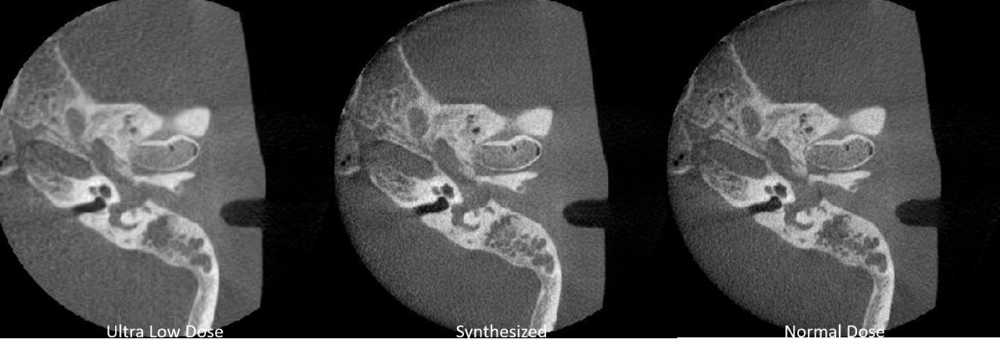

# Pix2PixHD for Dental CBCT Image Enhancement

This project uses [pix2pixHD](https://tcwang0509.github.io/pix2pixHD/) to enhance ultra-low-dose CBCT dental images to match the quality of normal-dose images. The implementation is based on NVIDIA's [Pix2PixHD](https://github.com/NVIDIA/pix2pixHD) architecture adapted for the dental imaging domain.

## Overview

Low-dose CBCT (Cone Beam Computed Tomography) is desirable in dental applications to reduce radiation exposure to patients. However, lower radiation often results in lower image quality with increased noise and reduced clarity. This project aims to generate high-quality, sharp images from ultra-low-dose CBCT scans using deep learning-based image-to-image translation.

## Example Results



## Dataset Structure

The dataset should be organized in the following structure:
```
datasets/
├── DentalCBCT/
│   ├── train_A/  # Ultra-low-dose images for training
│   ├── train_B/  # Normal-dose images for training
│   ├── test_A/   # Ultra-low-dose images for testing
│   └── test_B/   # Normal-dose images for testing
```

## Installation

### Requirements
1. Python 3.6+
2. PyTorch 1.0+ and torchvision
3. CUDA (for GPU acceleration)

### Setup Environment
```bash
# Create a new conda environment
conda create -n pix2pixdental python=3.7
conda activate pix2pixdental

# Install dependencies
pip install -r requirements.txt
```

## Usage

### 1. Data Preparation
Convert DICOM images to JPEG format:
```bash
python dicom2jpg.py
```

### 2. Training
Train the model with the following command:
```bash
python train.py --label_nc 0 --no_instance --name dental-dataset --dataroot ./datasets/DentalCBCT --save_epoch_freq 5
```

Optional parameters:
- `--continue_train`: Continue training from the latest checkpoint
- `--niter <n>`: Number of training epochs (default: 100)
- `--niter_decay <n>`: Number of epochs to linearly decay learning rate to zero (default: 100)

### 3. Testing
Generate enhanced images from test data:
```bash
python test.py --name dental-dataset --dataroot ./datasets/DentalCBCT --no_instance --label_nc 0 --how_many 146
```

### 4. Results
Results will be saved in `./results/dental-dataset/test_latest/images/` directory.

## Model Architecture

The model uses the Pix2PixHD architecture which consists of:
- A coarse-to-fine generator with global and local enhancer networks
- Multi-scale discriminators to improve image details
- Feature matching loss and VGG perceptual loss


## Acknowledgments

- This implementation is based on [pix2pixHD](https://github.com/NVIDIA/pix2pixHD) by NVIDIA
- Thanks to the original authors: Ting-Chun Wang, Ming-Yu Liu, Jun-Yan Zhu, Andrew Tao, Jan Kautz, Bryan Catanzaro